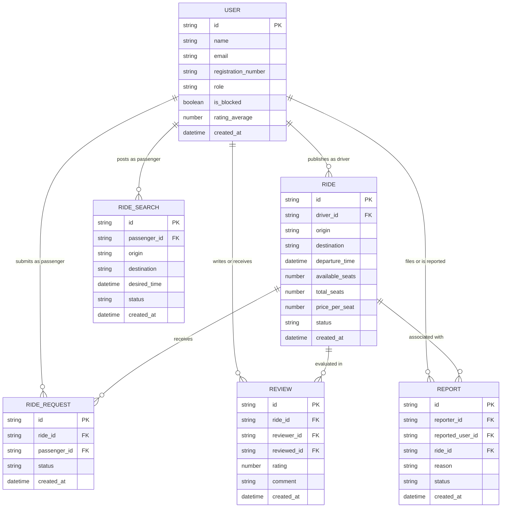

# 🏗️ Especificação de Arquitetura Técnica (Architecture / SSD)

**Projeto:** UTFRide  
**Versão:** 1.0.0  
**Data:** 2026-10-07  
**Status:** Aprovado  

> 🤖 **Este documento é a régua arquitetural e técnica do UTFRide.** Ele estabelece os padrões estruturais, a organização do código, o modelo de dados e os contratos de integração que o `/utf-setup`, os implementadores e os revisores devem seguir rigorosamente durante todo o ciclo de desenvolvimento.

---

## 💻 1. Stack Tecnológica e Padrões do Frontend (IDs 4 a 19)

### 1.1 Stack Principal
- **Framework Frontend:** **Angular 20+**
- **Paradigma de Componentização:** Arquitetura 100% **Standalone** (sem nenhum `NgModule`).
- **Framework CSS:** **Tailwind CSS** com sistema de tokens semânticos definido em [`docs/design-tokens.md`](file:///c:/Users/duduk/Documents/UTFRide/docs/design-tokens.md).
- **Gerenciamento de Estado:** **Signals** nativos do Angular (`signal()`, `computed()`, `model()`, `effect()`).
- **Testes Unitários:** **Vitest** com TDD estrito.
- **Linter:** **ESLint** (`@angular-eslint`).

### 1.2 Padrões de Código e UI Declarativa
- **Sintaxe de Controle de Fluxo:** Uso obrigatório de `@if`, `@switch` e `@for` com a diretiva de rastreamento `track` obrigatória (ex.: `@for (ride of rides(); track ride.id)`). Proibido o uso de `*ngIf` e `*ngFor`.
- **Carregamento Otimizado (@defer):** Aplicação de `@defer (on viewport / on interaction)` para carregar componentes sob demanda (ex.: modal de detalhes da oferta, formulário de avaliação e painel de moderação).
- **Comunicação Hierárquica:** Uso estrito das funções funcionais `input()`, `input.required()` e `output()` para comunicação tipada entre componentes pai e filho (sem decorators `@Input`/`@Output`).
- **Two-Way Data Binding:** Uso da função reativa `model()` para sincronização bidirecional de componentes de formulário/controles.
- **Injeção de Dependências:** Uso exclusivo da função `inject(ServiceName)` diretamente na inicialização de campos da classe (sem injeção via construtor).
- **Pipes:** Uso de pipes para formatação de dados monetários (`currencyBrl`), datas relativas e status de carona.

---

## 🗄️ 2. Persistência de Dados e Integrações por Fase (IDs 20 a 23, 25)

A persistência do UTFRide evolui em duas fases bem demarcadas:

### 2.1 Fase MVP (Entrega 2) — `json-server`
- **Arquivo de Dados:** `apps/api/db.json`
- **Execução:** `json-server --watch apps/api/db.json --port 3000`
- **Camada de Integração:** `HttpClient` do Angular consumindo `http://localhost:3000/`.
- **Coleções Mapeadas:** `users`, `rides`, `ride_requests`, `ride_searches`, `reviews`, `reports`.

### 2.2 Fase Completa (Entrega 3) — Backend-as-a-Service (**Supabase**)
- **Banco de Dados:** PostgreSQL hospedado no Supabase.
- **Autenticação:** Supabase Auth com gerenciamento de sessão via tokens **JWT** e validação de domínio institucional `@alunos.utfpr.edu.br`.
- **Segurança:** Políticas de Row Level Security (RLS) protegendo dados privados e restringindo alterações a proprietários dos registros.
- **Cliente:** Biblioteca oficial `@supabase/supabase-js` ou REST API do Supabase.

### 2.3 Regra Fundamental da Camada de Dados
> **Componente nunca fala com a rede ou com o banco.**  
> Todo acesso a dados passa exclusivamente por Services dedicados localizados em `apps/web/src/app/core/services/`. A migração do `json-server` para o **Supabase** na Entrega 3 ocorre **estritamente dentro dos Services**, mantendo os componentes de tela e templates completamente inalterados.

### 2.4 Interceptors e Reatividade Assíncrona
- **Functional Interceptors:**
  - `authInterceptor`: Injeta automaticamente o cabeçalho `Authorization: Bearer <token>` nas requisições HTTP.
  - `errorInterceptor`: Trata globalmente erros 401 (desloga e redireciona para `/login`), 403 (acesso proibido) e 500 (notificações visuais de falha).
- **Ponte RxJS ↔ Signals:** Conversão de chamadas assíncronas em Signals reativos nos Services através do utilitário `toSignal()`.

---

## 🛣️ 3. Roteamento, Navegação e Proteção de Rotas (IDs 16 a 19)

### 3.1 Configuração de Rotas
- Roteamento configurado funcionalmente via `provideRouter(routes, withComponentInputBinding())`.
- **Vinculação Automática de Parâmetros:** Parâmetros de rota (ex.: `:id`) e query params são consumidos diretamente nos componentes de página via `id = input.required<string>()`.

### 3.2 Mapa de Rotas e Lazy Loading
Todas as rotas de funcionalidades utilizam carregamento sob demanda (`loadComponent` ou `loadChildren`):

| Rota | Componente / Feature | Acesso | Descrição |
| :--- | :--- | :--- | :--- |
| `/` | `LandingComponent` | Público (Visitante) | Apresentação institucional do UTFRide |
| `/login` | `LoginComponent` | Público | Autenticação de aluno/suporte |
| `/register` | `RegisterComponent` | Público | Cadastro com e-mail institucional |
| `/rides` | `RideListComponent` | Autenticado | Busca e listagem de ofertas de carona |
| `/rides/:id` | `RideDetailComponent` | Autenticado | Detalhes da carona e solicitação de vaga |
| `/driver/offer` | `OfferRideComponent` | Autenticado (Motorista) | Formulário de oferta de nova carona |
| `/driver/my-rides`| `MyRidesComponent` | Autenticado (Motorista) | Gestão de ofertas e solicitações de passageiros |
| `/searches` | `RideSearchesComponent`| Autenticado (Passageiro) | Mural de pedidos ativos de carona |
| `/reviews/history`| `ReviewHistoryComponent`| Autenticado | Histórico de viagens e formulário de avaliação |
| `/support` | `SupportDashboardComponent`| Restrito (`support`) | Moderação de denúncias e suspensão de contas |

### 3.3 Functional Guards
- `authGuard`: Impede que visitantes não autenticados acessem rotas protegidas (redireciona para `/login`).
- `supportGuard`: Restringe o acesso ao painel `/support` exclusivamente para usuários com `role === 'support'`.

---

## 📂 4. Estrutura de Pastas e Regras de Dependência (IDs 4, 15, 18)

### 4.1 Árvore do Monorepo
```text
UTFRide/
├── apps/
│   ├── api/                     # API / Persistência do MVP
│   │   └── db.json              # Mock de dados para o json-server
│   └── web/                     # Frontend Angular 20+ Standalone
│       ├── public/              # Assets estáticos, manifest.webmanifest e ícones PWA
│       └── src/
│           ├── app/
│           │   ├── core/        # Singleton: Services de dados, Guards, Interceptors, Models
│           │   │   ├── guards/
│           │   │   ├── interceptors/
│           │   │   ├── models/
│           │   │   └── services/
│           │   ├── shared/      # UI Reutilizável: Componentes burros, Pipes, Diretivas
│           │   │   ├── components/
│           │   │   ├── pipes/
│           │   │   └── ui/
│           │   ├── features/    # Módulos por domínio de negócio (Rotas Lazy)
│           │   │   ├── auth/
│           │   │   ├── rides/
│           │   │   ├── driver/
│           │   │   ├── searches/
│           │   │   ├── reviews/
│           │   │   └── support/
│           │   ├── app.config.ts # Provedores funcionais (provideRouter, provideHttpClient)
│           │   ├── app.routes.ts # Definição central de rotas com lazy loading
│           │   └── app.component.ts
│           ├── index.html
│           ├── main.ts
│           └── styles.css       # Configurações do Tailwind CSS e Design Tokens
├── docs/                        # Documentação técnica e governança da Fase 0
│   ├── prd.md
│   ├── design-tokens.md
│   ├── architecture.md
│   └── checklist.md
└── package.json                 # Scripts raiz unificados
```

### 4.2 Regras Estritas de Dependência
1. `features/` pode importar de `core/` e de `shared/`.
2. `shared/` **nunca** importa de `features/` nem de `core/` (componentes puramente reutilizáveis).
3. `core/` **nunca** importa de `features/` nem de `shared/`.
4. Features **nunca** importam diretamente código de outras features (comunicação via serviços do `core/` ou via navegação de rotas).

---

## 📖 5. Glossário Técnico e Modelo de Domínio (PT → EN)

| Termo PRD (PT) | Entidade (EN) | Atributos e Tipos TypeScript |
| :--- | :--- | :--- |
| **Aluno / Usuário** | `User` | `id: string`<br>`name: string`<br>`email: string`<br>`registrationNumber: string`<br>`role: 'student' \| 'support'`<br>`isBlocked: boolean`<br>`ratingAverage: number`<br>`createdAt: string` |
| **Oferta de Carona** | `Ride` | `id: string`<br>`driverId: string`<br>`origin: string`<br>`destination: string`<br>`departureTime: string`<br>`availableSeats: number`<br>`totalSeats: number`<br>`pricePerSeat: number`<br>`status: 'active' \| 'full' \| 'completed' \| 'cancelled'`<br>`notes?: string`<br>`createdAt: string` |
| **Solicitação de Vaga**| `RideRequest` | `id: string`<br>`rideId: string`<br>`passengerId: string`<br>`status: 'pending' \| 'accepted' \| 'rejected' \| 'cancelled'`<br>`createdAt: string` |
| **Busca de Carona** | `RideSearch` | `id: string`<br>`passengerId: string`<br>`origin: string`<br>`destination: string`<br>`desiredTime: string`<br>`status: 'active' \| 'fulfilled' \| 'cancelled'`<br>`contactInfo: string`<br>`createdAt: string` |
| **Feedback / Avaliação**| `Review` | `id: string`<br>`rideId: string`<br>`reviewerId: string`<br>`reviewedId: string`<br>`rating: number` *(1 a 5)*<br>`comment?: string`<br>`createdAt: string` |
| **Denúncia / Moderação**| `Report` | `id: string`<br>`reporterId: string`<br>`reportedUserId: string`<br>`rideId?: string`<br>`reason: string`<br>`status: 'pending' \| 'resolved' \| 'dismissed'`<br>`resolutionNotes?: string`<br>`createdAt: string` |

---

## 📊 6. Diagrama Entidade-Relacionamento (Mermaid)



---

## 📋 7. Formulários e Validações (ID 24)

- **Abordagem:** **Formulários Reativos (`ReactiveFormsModule`)**.
- **Regras de Validação:**
  - `RegisterForm`: Validação estrita de e-mail institucional terminando em `@alunos.utfpr.edu.br`, matrícula preenchida, senha com mínimo de 6 caracteres.
  - `OfferRideForm`: Origem e destino obrigatórios, data/horário obrigatoriamente futuros em relação ao momento atual, vagas entre 1 e 4, valor maior ou igual a 0.
  - `RideSearchForm`: Origem, destino e data/hora futuros obrigatórios, telefone/WhatsApp de contato.
  - `ReportForm`: Motivo com mínimo de 15 caracteres.
- **Comportamento Visual:** Mensagens de erro contextuais e botão de submit com estado `[disabled]="form.invalid || loading()"`.

---

## 🧪 8. Testes Automatizados, Linters e Comandos de Execução (IDs 28, 33)

Todos os comandos são padronizados e executados a partir da raiz do monorepo:

| Comando | Descrição da Ação |
| :--- | :--- |
| `npm run dev` / `npm start` | Inicia o servidor frontend Angular local (`http://localhost:4200`) |
| `npm run server` | Inicia a API REST simulada com `json-server` (`http://localhost:3000`) |
| `npm test` | Executa a suíte de testes unitários com **Vitest** (`vitest run`) |
| `npm run lint` | Executa a validação estática de código com **ESLint** |
| `npm run build` | Gera o build de produção otimizado em `apps/web/dist` |

---

## 🚀 9. Gitflow e Deploy Contínuo (IDs 26 a 28)

- **Estratégia de Branching:** Gitflow estrito.
  - `main`: Reflete o ambiente de produção.
  - `develop`: Integração contínua da equipe.
  - `feature/<numero-da-issue>-<slug>`: Ramos de histórias gerados a partir da `develop`.
  - `chore/<slug>`: Tarefas de manutenção e infraestrutura.
- **Deploy de Produção:** Deploy automatizado na **Vercel** ou **Render** conectado à branch `main`.

---

## 🔍 10. Garantia do Setup (Quatro Declarações Obrigatórias do Passo 0)

1. **Framework do Frontend:** Angular 20+ Standalone, Signals, Tailwind CSS, sintaxe de templates moderna.
2. **Fonte de Dados:** MVP via `json-server` (`apps/api/db.json`); Fase E3 via **Supabase** (PostgreSQL + JWT Auth).
3. **Estrutura de Pastas:** Monorepo com `apps/web` (Angular), `apps/api` (mock/reservada) e separação `core/`, `shared/` e `features/`.
4. **Comandos de Teste e Lint:** `npm test` (Vitest) e `npm run lint` (ESLint) a partir da raiz.
