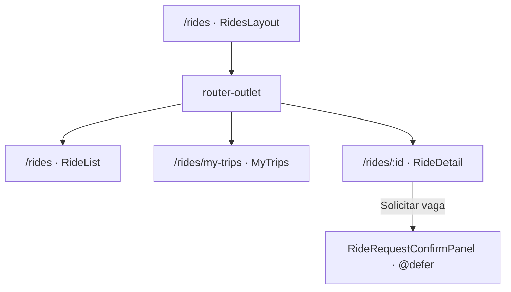
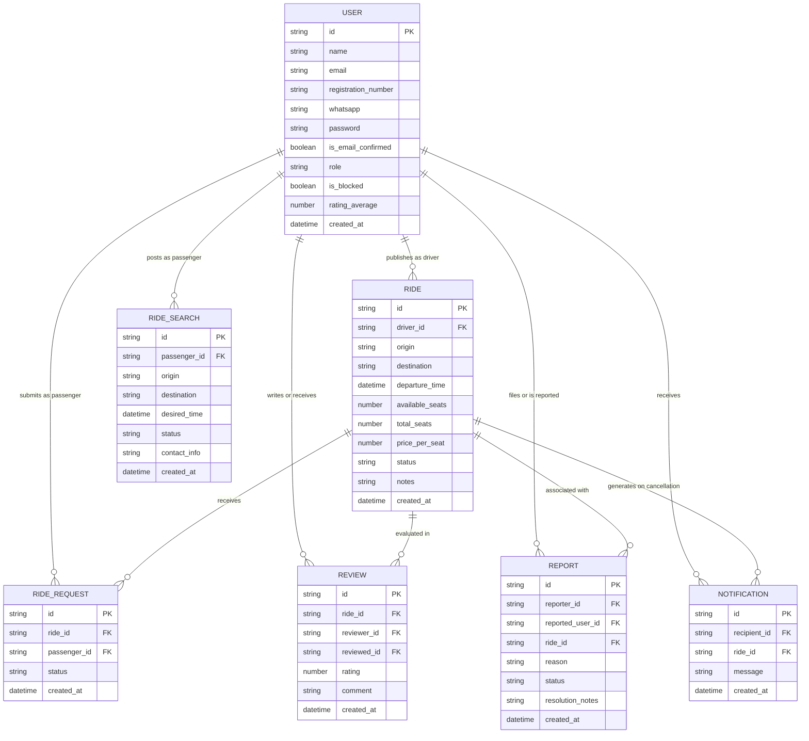

# 🏗️ Especificação de Arquitetura Técnica (Architecture / SSD)

**Projeto:** UTFRide  
**Versão:** 1.0.2<br>
**Data:** 2026-11-25<br>
**Status:** Aprovado  

> 🤖 **Este documento é a régua arquitetural e técnica do UTFRide.** Ele estabelece os padrões estruturais, a organização do código, o modelo de dados e os contratos de integração que o `/utf-setup`, os implementadores e os revisores devem seguir rigorosamente durante todo o ciclo de desenvolvimento.

---

## 💻 1. Stack Tecnológica e Padrões do Frontend (IDs 4 a 19)

### 1.1 Stack Principal
- **Framework Frontend:** **Angular 22** (setup com Angular 22.2.3 e Angular CLI 22.2.4; versões resolvidas no `package-lock.json`).
- **Paradigma de Componentização:** Arquitetura 100% **Standalone** (sem nenhum `NgModule`).
- **Framework CSS:** **Tailwind CSS** com sistema de tokens semânticos definido em [`docs/design-tokens.md`](file:///c:/Users/duduk/Documents/UTFRide/docs/design-tokens.md).
- **Gerenciamento de Estado:** **Signals** nativos do Angular (`signal()`, `computed()`, `model()`, `effect()`).
- **Cliente BaaS e Autenticação:** **`@supabase/supabase-js`** (Supabase Auth, sessão persistente e integração com o projeto Supabase).
- **Testes Unitários:** **Vitest** com TDD estrito, integrado ao builder `@angular/build:unit-test` do Angular CLI.
- **Linter:** **ESLint** (`@angular-eslint`).

### 1.2 Padrões de Código e UI Declarativa
- **Sintaxe de Controle de Fluxo:** Uso obrigatório de `@if`, `@switch` e `@for` com a diretiva de rastreamento `track` obrigatória (ex.: `@for (ride of rides(); track ride.id)`). Proibido o uso de `*ngIf` e `*ngFor`.
- **Carregamento Otimizado (@defer):** Aplicação de `@defer (on viewport / on interaction)` para carregar componentes sob demanda (ex.: modal de detalhes da oferta, formulário de avaliação e painel de moderação).
- **Comunicação Hierárquica:** Uso estrito das funções funcionais `input()`, `input.required()` e `output()` para comunicação tipada entre componentes pai e filho (sem decorators `@Input`/`@Output`).
- **Two-Way Data Binding:** Uso da função reativa `model()` para sincronização bidirecional de componentes de formulário/controles.
- **Injeção de Dependências:** Uso exclusivo da função `inject(ServiceName)` diretamente na inicialização de campos da classe (sem injeção via construtor).
- **Pipes:** Uso de pipes para formatação de dados monetários (`currencyBrl`), datas relativas e status de carona.

---

## 🗄️ 2. Persistência de Dados e Integrações por Fase (IDs 20 a 23, 25)

A persistência do UTFRide evolui em duas fases bem demarcadas:

### 2.1 Fase MVP e Transição de Autenticação — `json-server` + Supabase Auth
- **Arquivo de Dados:** `apps/api/db.json`
- **Execução** — `npm run server` na raiz do repositório disponibiliza a API na porta 3000. `apps/api/start.mjs` carrega o arquivo de dados e inicia `createServer` de `apps/api/server.mjs`.
- **Camada de Integração:** `HttpClient` do Angular consumindo `http://localhost:3000/` com `authInterceptor` anexando o token JWT da sessão quando disponível.
- **Coleções Mapeadas:** `users`, `rides`, `ride_requests`, `ride_searches`, `reviews`, `reports`, `notifications`.
- **Autenticação e sessão (Supabase Auth na fase transitória):** o cadastro e o login migram da simulação em memória no `json-server` para o **Supabase Auth** (`@supabase/supabase-js`, via `signUp`, `signInWithPassword`, `signOut` e restauração de sessão persistida em navegador no recarregamento da página). A sessão autenticada emite um token **JWT** (`access_token`) verificado pelo `authGuard` e enviado pelo `authInterceptor`. Os demais dados de domínio (`rides`, `ride_requests`, `notifications` e perfis vinculados) permanecem temporariamente no `json-server` até a migração das tabelas na Entrega 3.
- **Consulta de caronas** — `GET /driver-summaries?id=…` retorna apenas identificador, nome e avaliação média do motorista. `GET /passenger-trip-summaries?passengerId=…` filtra pelo ID textual da sessão e projeta os resumos de Minhas Viagens. O WhatsApp é incluído apenas nas solicitações aceitas de caronas ativas ou lotadas. O parâmetro `passengerId` identifica o filtro da consulta. A verificação da identidade no servidor com RLS está prevista na fase completa no Supabase.
- **Gravações de solicitações** — `POST /ride_requests` confere a existência de pedido pendente ou aceito para o mesmo par oferta e passageiro dentro da fila de gravação. `PATCH /ride_requests/:id?passengerId=…` verifica a titularidade e o estado pendente no momento do cancelamento voluntário. A fila é compartilhada pela instância do servidor e publica o novo estado depois que a gravação do JSON é concluída.

### 2.2 Fase Completa (Entrega 3) — Backend-as-a-Service (**Supabase**)
- **Banco de Dados:** PostgreSQL hospedado no Supabase.
- **Autenticação:** Supabase Auth com gerenciamento de sessão via tokens **JWT** e validação de domínio institucional `@alunos.utfpr.edu.br`.
- **Segurança:** Políticas de Row Level Security (RLS) protegendo dados privados e restringindo alterações a proprietários dos registros.
- **Cliente:** Biblioteca oficial `@supabase/supabase-js` encapsulada nos Services do `core/services/`.

### 2.3 Regra Fundamental da Camada de Dados
> **Componente nunca fala com a rede ou com o banco.**  
> Todo acesso a dados passa exclusivamente por Services dedicados localizados em `apps/web/src/app/core/services/`. A migração do `json-server` para o **Supabase** na Entrega 3 ocorre **estritamente dentro dos Services**, mantendo os componentes de tela e templates completamente inalterados.

### 2.4 Interceptors e Reatividade Assíncrona
- **Functional Interceptors:**
  - `authInterceptor`: Lê o token JWT (`access_token`) da sessão ativa no Supabase Auth e injeta automaticamente o cabeçalho `Authorization: Bearer <token>` nas requisições HTTP do `HttpClient`.
  - `errorInterceptor`: Trata globalmente erros 401 (encerra a sessão no `AuthData` e redireciona para `/login`), 403 (acesso proibido), 500 e falhas de servidor/rede, respeitando os tokens de contexto `SKIP_GLOBAL_ERROR_HANDLING` e `HANDLE_SESSION_EXPIRATION_ONLY`.
- **Ponte RxJS ↔ Signals:** Conversão de chamadas assíncronas em Signals reativos nos Services através dos utilitários `toSignal()` e `toObservable()`.

### 2.5 Ambientes e Segredos (Supabase)
- **Projeto Supabase da equipe:** Projeto compartilhado pela organização da equipe na plataforma `supabase.com`, criado na região **São Paulo**, com referência `qeoenmfkfrhabznkekjp` (`https://qeoenmfkfrhabznkekjp.supabase.co`).
- **Configuração no Painel (Desenvolvimento):** `Site URL` configurada para `http://localhost:4200` em *Authentication → URL Configuration*, e confirmação automática de e-mail (*Confirm email*) desabilitada durante o desenvolvimento no plano gratuito.
- **Arquivos de Ambiente (`apps/web/src/environments/`):**
  - `environment.ts` (produção) e `environment.development.ts` (desenvolvimento local), expondo `apiUrl` (enquanto os dados utilizam `json-server`), `supabaseUrl` e `supabasePublishableKey`.
- **Política de Chaves (Pública vs. Secreta):**
  - **Chave Publicável (`sb_publishable_...`):** **pode** ser versionada no Git dentro de `environments/` e enviada no código cliente (`createClient(supabaseUrl, supabasePublishableKey)`), pois identifica apenas o projeto na borda pública; a proteção real dos dados é garantida pelo JWT do usuário autenticado e pelas políticas de **Row Level Security (RLS)** no servidor.
  - **Chave Secreta (`sb_secret_...` / `service_role`):** **nunca** deve ser colocada no código frontend, nos arquivos `environments/` ou em qualquer commit do repositório, pois contorna o RLS e concede acesso administrativo irrestrito ao projeto.
- **Isolamento em Testes Automatizados:** os testes unitários (Vitest) **nunca** executam chamadas reais ao Supabase; o cliente `@supabase/supabase-js` é encapsulado em `core/services/` e substituído por dublês/mocks em memória nos testes.

---

## 🛣️ 3. Roteamento, Navegação e Proteção de Rotas (IDs 16 a 19)

### 3.1 Configuração de Rotas
- Roteamento configurado funcionalmente via `provideRouter(routes, withComponentInputBinding())`.
- **Vinculação Automática de Parâmetros:** Parâmetros de rota (ex.: `:id`) e query params são consumidos diretamente nos componentes de página via `id = input.required<string>()`.

### 3.2 Mapa de Rotas e Lazy Loading
Todas as rotas de funcionalidades utilizam carregamento sob demanda (`loadComponent` ou `loadChildren`):

| Rota | Componente / Feature | Acesso | Descrição |
| :--- | :--- | :--- | :--- |
| `/` | `LandingComponent` | Público (Visitante) | Apresentação institucional do UTFRide |
| `/login` | `LoginComponent` | Público | Autenticação de aluno/suporte |
| `/register` | `RegisterComponent` | Público | Cadastro com e-mail institucional |
| `/rides` | `RidesLayout` → `RideList` | Autenticado | Busca reativa de ofertas de carona e sugestões de municípios do IBGE |
| `/rides/my-trips` | `RidesLayout` → `MyTrips` | Autenticado | Solicitações do passageiro, contato nas confirmadas e cancelamento das pendentes |
| `/rides/:id` | `RidesLayout` → `RideDetail` | Autenticado | Dados da oferta e painel de confirmação de vaga carregado sob demanda |
| `/driver/offer` | `OfferRideComponent` | Autenticado (Motorista) | Formulário de publicação e edição de oferta de carona (`?rideId=`) |
| `/driver/my-rides`| `MyRidesComponent` | Autenticado (Motorista) | Gestão de ofertas e solicitações de passageiros |
| `/searches` | `RideSearchesComponent`| Autenticado (Passageiro) | Mural de pedidos ativos de carona |
| `/reviews/history`| `ReviewHistoryComponent`| Autenticado | Histórico de viagens e formulário de avaliação |
| `/support` | `SupportDashboardComponent`| Restrito (`support`) | Moderação de denúncias e suspensão de contas |

`RidesLayout` mantém o cabeçalho e a navegação inferior. O `router-outlet` exibe a rota filha. O `authGuard` protege a entrada e a ativação das filhas. `my-trips` é declarada antes de `:id` para que o endereço fixo seja resolvido primeiro.


```mermaid
flowchart TD
    Layout["/rides · RidesLayout"] --> Outlet["router-outlet"]
    Outlet --> List["/rides · RideList"]
    Outlet --> Trips["/rides/my-trips · MyTrips"]
    Outlet --> Detail["/rides/:id · RideDetail"]
    Detail -->|Solicitar vaga| Confirm["RideRequestConfirmPanel · @defer"]
```

### 3.3 Functional Guards
- `authGuard`: Impede que visitantes não autenticados acessem rotas protegidas (redireciona para `/login`).
- `supportGuard`: Restringe o acesso ao painel `/support` exclusivamente para usuários com `role === 'support'`.

---

## 📂 4. Estrutura de Pastas e Regras de Dependência (IDs 4, 15, 18)

### 4.1 Árvore do Monorepo
```text
UTFRide/
├── apps/
│   ├── api/                     # API / Persistência do MVP
│   │   ├── start.mjs            # Inicialização do servidor local
│   │   ├── server.mjs           # Rotas do MVP e fila de gravações
│   │   ├── server.test.mjs      # Testes HTTP da API
│   │   └── db.json              # Mock de dados para o json-server
│   └── web/                     # Frontend Angular 22 Standalone
│       ├── public/              # Assets estáticos, manifest.webmanifest e ícones PWA
│       └── src/
│           ├── app/
│           │   ├── core/        # Singleton: Services de dados, Guards, Interceptors, Models
│           │   │   ├── guards/
│           │   │   ├── interceptors/
│           │   │   ├── models/
│           │   │   └── services/
│           │   ├── shared/      # UI Reutilizável: Componentes burros, Pipes, Diretivas
│           │   │   ├── components/
│           │   │   ├── pipes/
│           │   │   └── ui/
│           │   ├── features/    # Módulos por domínio de negócio (Rotas Lazy)
│           │   │   ├── auth/
│           │   │   ├── rides/
│           │   │   │   ├── rides-layout/
│           │   │   │   ├── ride-list/
│           │   │   │   ├── ride-filters/
│           │   │   │   ├── ride-detail/
│           │   │   │   │   └── ride-request-confirm-panel/
│           │   │   │   └── my-trips/
│           │   │   ├── driver/
│           │   │   ├── searches/
│           │   │   ├── reviews/
│           │   │   └── support/
│           │   ├── app.config.ts # Provedores funcionais (provideRouter, provideHttpClient)
│           │   ├── app.routes.ts # Definição central de rotas com lazy loading
│           │   ├── app.ts        # Componente raiz (nomes padrão do Angular CLI atual)
│           │   ├── app.html      # Template do componente raiz
│           │   └── app.css       # Estilos do componente raiz
│           ├── environments/     # Configurações de ambiente (environment.ts / development)
│           ├── index.html
│           ├── main.ts
│           └── styles.css       # Configurações do Tailwind CSS e Design Tokens
├── docs/                        # Documentação técnica e governança da Fase 0
│   ├── prd.md
│   ├── design-tokens.md
│   ├── architecture.md
│   └── checklist.md
└── package.json                 # Scripts raiz unificados
```

### 4.2 Regras Estritas de Dependência
1. `features/` pode importar de `core/` e de `shared/`.
2. `shared/` **nunca** importa de `features/` nem de `core/` (componentes puramente reutilizáveis).
3. `core/` **nunca** importa de `features/` nem de `shared/`.
4. Features **nunca** importam diretamente código de outras features (comunicação via serviços do `core/` ou via navegação de rotas).

---

## 📖 5. Glossário Técnico e Modelo de Domínio (PT → EN)

Para garantir consistência e evitar ambiguidades conceituais, todos os termos ubíquos definidos no [`docs/prd.md`] possuem correspondência direta no código:

| Termo PRD (PT) | Equivalente Técnico (EN) | Natureza no Código | Atributos e Tipos TypeScript / Detalhes |
| :--- | :--- | :--- | :--- |
| **Aluno** | `User` (`role: 'student'`) | Entidade / Modelo | `id: string`<br>`name: string`<br>`email: string`<br>`registrationNumber: string`<br>`role: 'student' \| 'support'`<br>`isBlocked: boolean`<br>`ratingAverage: number`<br>`createdAt: string` |
| **Motorista** | `driverId` | Papel contextual do `User` | Identificador do aluno autor de uma oferta (`driverId: string` em `Ride`) |
| **Passageiro** | `passengerId` | Papel contextual do `User` | Identificador do aluno solicitante (`passengerId: string` em `RideRequest` e `RideSearch`) |
| **Oferta de Carona** / **Carona** | `Ride` | Entidade / Ciclo de vida | `id: string`<br>`driverId: string`<br>`origin: string`<br>`destination: string`<br>`departureTime: string`<br>`availableSeats: number`<br>`totalSeats: number`<br>`pricePerSeat: number`<br>`status: 'active' \| 'full' \| 'completed' \| 'cancelled'`<br>`notes?: string`<br>`createdAt: string`<br>*Nota: "Oferta de Carona" (anúncio aberto com vagas) evolui para "Carona" (viagem confirmada) através da máquina de estados do atributo `status`.* |
| **Vaga** | `availableSeats` / `totalSeats` | Atributos de capacidade | Controlam assentos individuais disponíveis e totais no objeto `Ride` |
| **Solicitação de Carona** | `RideRequest` | Entidade | `id: string`<br>`rideId: string`<br>`passengerId: string`<br>`status: 'pending' \| 'accepted' \| 'rejected' \| 'cancelled'`<br>`createdAt: string` |
| **Busca de Carona** | `RideSearch` | Entidade | `id: string`<br>`passengerId: string`<br>`origin: string`<br>`destination: string`<br>`desiredTime: string`<br>`status: 'active' \| 'fulfilled' \| 'cancelled'`<br>`contactInfo: string`<br>`createdAt: string` |
| **Feedback** | `Review` | Entidade | `id: string`<br>`rideId: string`<br>`reviewerId: string`<br>`reviewedId: string`<br>`rating: number` *(1 a 5)*<br>`comment?: string`<br>`createdAt: string` |
| **Denúncia** | `Report` | Entidade | `id: string`<br>`reporterId: string`<br>`reportedUserId: string`<br>`rideId?: string`<br>`reason: string`<br>`status: 'pending' \| 'resolved' \| 'dismissed'`<br>`resolutionNotes?: string`<br>`createdAt: string` |
| **Aviso interno** | `Notification` | Entidade | `id: string`<br>`recipientId: string`<br>`rideId: string`<br>`message: string`<br>`createdAt: string` |
| **Suporte** | `role: 'support'` | Perfil / Permissão | Representado pelo valor de `role` no `User`, protegido por `supportGuard` na rota `/support` |

---

## 📊 6. Diagrama Entidade-Relacionamento (Mermaid)


```mermaid
erDiagram
    USER ||--o{ RIDE : "publishes as driver"
    USER ||--o{ RIDE_REQUEST : "submits as passenger"
    USER ||--o{ RIDE_SEARCH : "posts as passenger"
    USER ||--o{ REVIEW : "writes or receives"
    USER ||--o{ REPORT : "files or is reported"
    USER ||--o{ NOTIFICATION : "receives"
    
    RIDE ||--o{ RIDE_REQUEST : "receives"
    RIDE ||--o{ REVIEW : "evaluated in"
    RIDE ||--o{ REPORT : "associated with"
    RIDE ||--o{ NOTIFICATION : "generates on cancellation"

    USER {
        string id PK
        string name
        string email
        string registration_number
        string whatsapp
        string password
        boolean is_email_confirmed
        string role
        boolean is_blocked
        number rating_average
        datetime created_at
    }

    RIDE {
        string id PK
        string driver_id FK
        string origin
        string destination
        datetime departure_time
        number available_seats
        number total_seats
        number price_per_seat
        string status
        string notes
        datetime created_at
    }

    RIDE_REQUEST {
        string id PK
        string ride_id FK
        string passenger_id FK
        string status
        datetime created_at
    }

    RIDE_SEARCH {
        string id PK
        string passenger_id FK
        string origin
        string destination
        datetime desired_time
        string status
        string contact_info
        datetime created_at
    }

    REVIEW {
        string id PK
        string ride_id FK
        string reviewer_id FK
        string reviewed_id FK
        number rating
        string comment
        datetime created_at
    }

    REPORT {
        string id PK
        string reporter_id FK
        string reported_user_id FK
        string ride_id FK
        string reason
        string status
        string resolution_notes
        datetime created_at
    }

    NOTIFICATION {
        string id PK
        string recipient_id FK
        string ride_id FK
        string message
        datetime created_at
    }
```

---

## 📋 7. Formulários e Validações (ID 24)

- **Abordagem:** **Formulários Reativos (`ReactiveFormsModule`)**.
- **Regras de Validação:**
  - `RegisterForm`: Validação estrita de e-mail institucional terminando em `@alunos.utfpr.edu.br`, matrícula preenchida, senha com mínimo de 6 caracteres.
  - `OfferRideForm`: Origem e destino obrigatórios, data/horário obrigatoriamente futuros em relação ao momento atual, vagas entre 1 e 4, valor maior ou igual a 0.
  - `RideSearchForm`: Origem, destino e data/hora futuros obrigatórios, telefone/WhatsApp de contato.
  - `ReportForm`: Motivo com mínimo de 15 caracteres.
- **Comportamento Visual:** Mensagens de erro contextuais e botão de submit com estado `[disabled]="form.invalid || loading()"`.

---

## 🧪 8. Testes Automatizados, Linters e Comandos de Execução (IDs 28, 33)

Todos os comandos são padronizados e executados a partir da raiz do monorepo:

| Comando | Descrição da Ação |
| :--- | :--- |
| `npm run dev` / `npm start` | Inicia o servidor frontend Angular local (`http://localhost:4200`) |
| `npm run server` | Inicia a API REST simulada com `json-server` (`http://localhost:3000`) |
| `npm test` | Executa a suíte **Vitest** pelo Angular CLI (`ng test --watch=false` no workspace `apps/web`) |
| `node --test apps/api/server.test.mjs` | Executa os testes HTTP do MVP com dados isolados e porta local temporária |
| `npm run lint` | Executa a validação estática de código com **ESLint** |
| `npm run build` | Gera o build de produção otimizado em `apps/web/dist` |

---

## 🚀 9. Gitflow e Deploy Contínuo (IDs 26 a 28)

- **Estratégia de Branching:** Gitflow estrito.
  - `main`: Reflete o ambiente de produção.
  - `develop`: Integração contínua da equipe.
  - `feature/<numero-da-issue>-<slug>`: Ramos de histórias gerados a partir da `develop`.
  - `chore/<slug>`: Tarefas de manutenção e infraestrutura.
- **Deploy de Produção:** Deploy automatizado na **Vercel** ou **Render** conectado à branch `main`.

---

## 🔍 10. Garantia do Setup (Quatro Declarações Obrigatórias do Passo 0)

1. **Framework do Frontend:** Angular 22 Standalone, Signals, Tailwind CSS, sintaxe de templates moderna.
2. **Fonte de Dados:** MVP via `json-server` (`apps/api/db.json`); Fase E3 via **Supabase** (PostgreSQL + JWT Auth).
3. **Estrutura de Pastas:** Monorepo com `apps/web` (Angular), `apps/api` (mock/reservada) e separação `core/`, `shared/` e `features/`.
4. **Comandos de Teste e Lint:** `npm test` (Vitest) e `npm run lint` (ESLint) a partir da raiz.
